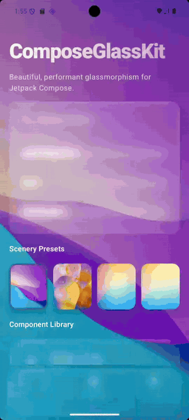
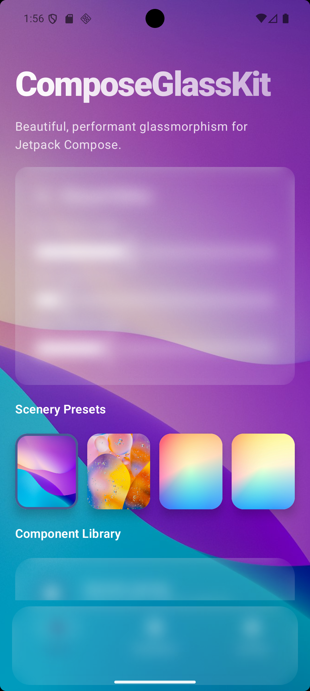
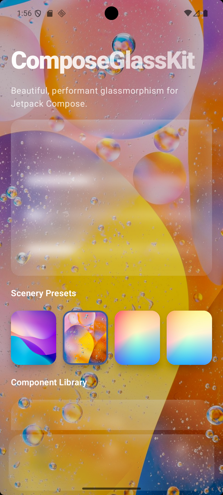
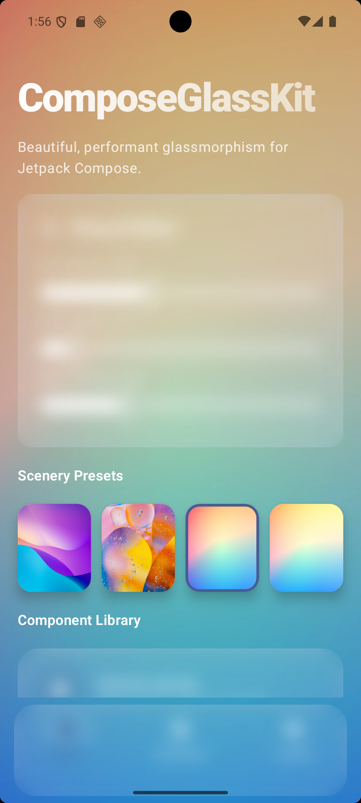

# ComposeGlassKit

[](LICENSE)
[](https://kotlinlang.org/)
[](https://developer.android.com/)
[](https://central.sonatype.com/artifact/io.github.saadkhalidkhan/compose-glasskit)
[](https://jitpack.io/#saadkhalidkhan/ComposeGlassKitTheme)
[](glasskit/build.gradle.kts)
[](sample/build.gradle.kts)
[](CONTRIBUTING.md)
[](https://github.com/saadkhalidkhan/ComposeGlassKitTheme/actions/workflows/android-ci.yml)

A **Jetpack Compose** library for **glassmorphism** UI — translucent surfaces, gradient borders, configurable blur, and ready-made components (`GlassCard`, `GlassButton`, `GlassNavBar`, `GlassDialog`) with **Material 3** support.

[**Report a bug**](https://github.com/saadkhalidkhan/ComposeGlassKitTheme/issues) · [**Contributing**](CONTRIBUTING.md) · [**Security**](SECURITY.md)

<p align="center">
  
</p>

---

## Features

- **Glass components** — `GlassCard`, `GlassButton`, `GlassNavBar`, `GlassDialog`
- **Customizable effects** — blur radius, fill opacity, gradient borders
- **Material 3** — dynamic color, M3 shapes and color roles
- **Global theme** — `GlassTheme` + `GlassConfig` via composition locals
- **Dialog backdrop blur** — window blur on Android 12+ (API 31+)
- **Sample app** — live visual editor over photo backgrounds

## Table of contents

- [Preview](#preview)
- [Requirements](#requirements)
- [Installation](#installation)
- [Quick start](#quick-start)
- [Usage examples](#usage-examples)
- [Components](#components)
- [Blur strategy](#blur-strategy)
- [Sample app](#sample-app)
- [Modules](#modules)
- [Publishing](#publishing)
- [Documentation](#documentation)
- [Contributing](#contributing)
- [License](#license)
- [Author](#author)

## Preview

Sample app with different background presets and live glass controls:

| Theme 1 | Theme 2 | Theme 3 |
|:-------:|:-------:|:-------:|
|  |  |  |

## Requirements

| Requirement | Version |
|-------------|---------|
| Android API | **26+** |
| Jetpack Compose | BOM **2024.09.00** (see `gradle/libs.versions.toml`) |
| Kotlin | **2.2.10** |
| Dialog window blur | **API 31+** (fallback on older devices) |

## Installation

### 1. Maven Central (recommended)

Published on [Maven Central](https://central.sonatype.com/artifact/io.github.saadkhalidkhan/compose-glasskit). `mavenCentral()` is enough — no extra repository.

| | |
|---|---|
| **Group** | `io.github.saadkhalidkhan` |
| **Artifact** | `compose-glasskit` |
| **Version** | `1.0.0` (`VERSION_NAME` in `gradle.properties`) |

```kotlin
// settings.gradle.kts
dependencyResolutionManagement {
    repositories {
        google()
        mavenCentral()
    }
}
```

```kotlin
// app/build.gradle.kts
dependencies {
    implementation("io.github.saadkhalidkhan:compose-glasskit:1.0.0")
}
```

Check [Maven Central](https://central.sonatype.com/artifact/io.github.saadkhalidkhan/compose-glasskit) or [search.maven.org](https://search.maven.org/search?q=g:io.github.saadkhalidkhan%20AND%20a:compose-glasskit) for newer versions.

### 2. JitPack (alternative)

JitPack uses **GitHub** coordinates (`com.github.saadkhalidkhan`), not the Maven Central group (`io.github.saadkhalidkhan`).

1. Tag a release on GitHub (e.g. `v1.0.0`).
2. Build it on [JitPack](https://jitpack.io/#saadkhalidkhan/ComposeGlassKitTheme).
3. Add the repository and dependency:

```kotlin
// settings.gradle.kts
dependencyResolutionManagement {
    repositories {
        google()
        mavenCentral()
        maven { url = uri("https://jitpack.io") }
    }
}
```

```kotlin
// app/build.gradle.kts
dependencies {
    implementation("com.github.saadkhalidkhan:ComposeGlassKitTheme:v1.0.0")
}
```

If resolution fails, try `…:glasskit:v1.0.0` or copy the Gradle line from the [JitPack build page](https://jitpack.io/#saadkhalidkhan/ComposeGlassKitTheme) for your tag.

### 3. Module dependency (monorepo / local)

```kotlin
// settings.gradle.kts
include(":glasskit")

// your-app/build.gradle.kts
dependencies {
    implementation(project(":glasskit"))
}
```

## Quick start

```kotlin
import androidx.compose.foundation.layout.fillMaxWidth
import androidx.compose.foundation.layout.padding
import androidx.compose.material3.Text
import androidx.compose.ui.Modifier
import androidx.compose.ui.unit.dp
import com.saadkhan.composeglasskit.components.GlassCard
import com.saadkhan.composeglasskit.theme.GlassConfig
import com.saadkhan.composeglasskit.theme.GlassTheme

@Composable
fun GlassHelloScreen() {
    // Use a full-screen background (image/gradient) behind this content.
    GlassTheme(
        config = GlassConfig(
            blurRadius = 16.dp,
            containerAlpha = 0.15f,
            borderAlpha = 0.25f,
        ),
    ) {
        GlassCard(modifier = Modifier.fillMaxWidth().padding(16.dp)) {
            Text(
                text = "Hello, glass.",
                modifier = Modifier.padding(24.dp),
            )
        }
    }
}
```

## Usage examples

More recipes (buttons, nav bar, dialog, custom modifier):

**[docs/USAGE.md](docs/USAGE.md)**

```kotlin
// Glass button
GlassButton(onClick = { }, shape = RoundedCornerShape(16.dp)) {
    Text("Open")
}

// Glass dialog (API 31+ window blur)
GlassDialog(onDismissRequest = { showDialog = false }) {
    Text("Modal content", modifier = Modifier.padding(24.dp))
}
```

## Components

| Component | Description |
|-----------|-------------|
| [`GlassTheme`](glasskit/src/main/java/com/saadkhan/composeglasskit/theme/GlassTheme.kt) | Global `GlassConfig` provider |
| [`GlassConfig`](glasskit/src/main/java/com/saadkhan/composeglasskit/theme/GlassTheme.kt) | Blur, alpha, border defaults |
| [`Modifier.glassEffect()`](glasskit/src/main/java/com/saadkhan/composeglasskit/modifiers/GlassModifier.kt) | Core glass surface modifier |
| [`GlassCard`](glasskit/src/main/java/com/saadkhan/composeglasskit/components/GlassCard.kt) | Card container |
| [`GlassButton`](glasskit/src/main/java/com/saadkhan/composeglasskit/components/GlassButton.kt) | Clickable button |
| [`GlassNavBar`](glasskit/src/main/java/com/saadkhan/composeglasskit/components/GlassNavBar.kt) | Glass `NavigationBar` |
| [`GlassDialog`](glasskit/src/main/java/com/saadkhan/composeglasskit/components/GlassDialog.kt) | Modal with backdrop blur |

Full API reference: **[docs/API.md](docs/API.md)**

## Blur strategy

ComposeGlassKit uses **layer blur** for surfaces and **window blur** for dialogs on API 31+.

Read limitations and layout tips: **[docs/BLUR.md](docs/BLUR.md)**

## Sample app

Run **ComposeGlassKit Sample** (`:sample`) to tweak blur and opacity over Unsplash backgrounds:

```bash
./gradlew :sample:assembleDebug
./gradlew :sample:installDebug
```

## Modules

| Module | Description |
|--------|-------------|
| `:glasskit` | Publishable Android library |
| `:sample` | Interactive showcase app |

## Publishing

For maintainers. Copy `local.properties.example` to `local.properties` and set Maven Central token + GPG signing keys (see [Vanniktech plugin docs](https://vanniktech.github.io/gradle-maven-publish-plugin/central/)).

```bash
# Install to local ~/.m2
./gradlew :glasskit:publishToMavenLocal

# Upload to Maven Central (then publish the deployment on central.sonatype.com)
./gradlew :glasskit:publishToMavenCentral
```

GitHub release tags (`v*`) trigger the [release workflow](.github/workflows/release.yml) (APK/AAR artifacts). CI runs on every push via [Android CI](.github/workflows/android-ci.yml).

## Documentation

| Doc | Contents |
|-----|----------|
| [docs/API.md](docs/API.md) | Parameters and components |
| [docs/USAGE.md](docs/USAGE.md) | Copy-paste examples |
| [docs/BLUR.md](docs/BLUR.md) | Blur behavior and performance |
| [docs/media/README.md](docs/media/README.md) | Screenshots & GIF guide |
| [CHANGELOG.md](CHANGELOG.md) | Version history |

## Contributing

Contributions are welcome. Please read [CONTRIBUTING.md](CONTRIBUTING.md) and our [Code of Conduct](CODE_OF_CONDUCT.md) before opening an issue or pull request.

1. Open an issue to discuss larger changes.
2. Fork the repo and create a branch from `master`.
3. Run `./gradlew :glasskit:test :glasskit:assembleRelease :sample:assembleDebug` before opening a PR.
4. Open a pull request with a clear description and media for UI changes.

## License

This project is licensed under the **Apache License 2.0** — see [LICENSE](LICENSE).

```
Copyright 2026 Saad Khan
```

## Author

**Saad Khan** — [GitHub](https://github.com/saadkhalidkhan) · [Medium](https://medium.com/@saadkhan0799) · [ranasaad0799@gmail.com](mailto:ranasaad0799@gmail.com)

If this library helps you, consider starring the repo.
